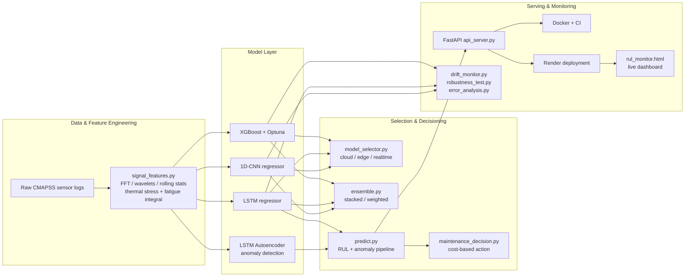

# Edge-AI Predictive Maintenance System

An end-to-end predictive maintenance pipeline built for the kind of decision
industrial teams actually need to make: *not just "will this machine fail,"
but "which model should make that call given this device's constraints, how
much do we trust it, and what should we do right now."*

Two real-world tasks are covered:
- **Turbofan engine Remaining Useful Life (RUL) prediction** — NASA CMAPSS
  dataset, the primary focus of this project (Weeks 2–9 below).
- **CNC tool-wear failure classification** — AI4I dataset, an earlier
  exploration (Week 1) kept in the repo as the source of the edge/cloud
  model-selector pattern later reused for the RUL models.

**Live demo:** [edge-ai-predictive-maintenance.onrender.com](https://edge-ai-predictive-maintenance.onrender.com)
(hosted on Render's free tier — see [Known Limitations](#known-limitations)
for what that means for first-request latency)

**Live dashboard:** open `dashboard/rul_monitor.html` locally, or visit it and
point the API base field at the URL above.

---

## Why this exists

Most "ML for predictive maintenance" portfolio projects stop at a notebook
with an RMSE number. This one is built around the questions a real
industrial deployment actually has to answer:

1. **Which model, on which device?** A cloud gateway and a constrained edge
   sensor node don't want the same model — see [Model Selection](#model-selection--ensembling).
2. **Does the model fail gracefully or catastrophically** when sensors drift,
   go noisy, or drop out? — see [Drift & Robustness](#drift-monitoring--robustness).
3. **What does a prediction actually cost the business** if it's acted on,
   or ignored? — see [Cost-Based Maintenance Decisions](#cost-based-maintenance-decisions).
4. **Where does it actually fail**, and is that failure mode dangerous
   (predicting more life than an asset really has) or just imprecise? —
   see [Error Analysis](#error-analysis-by-rul-bucket).

Every claim below is backed by a script you can re-run against the real
held-out CMAPSS test engines — nothing here is asserted without the number
next to it.

---

## Architecture



---

## Results across all models (real held-out CMAPSS test set, 100 engines)

| Model | RMSE | CMAPSS Score* | Size (ONNX) | Single-row latency |
|---|---|---|---|---|
| XGBoost (Optuna-tuned) | 13.993 | 320.4 | 744.0 KB | 0.028 ms |
| LSTM | **12.803** | **267.0** | 218.3 KB | 0.457 ms |
| 1D-CNN | 18.063 | 649.7 | 134.2 KB | 0.684 ms |
| Ensemble (stacked, Ridge meta-learner) | 12.834 | — | — | — |

\* Lower is better on both metrics. The CMAPSS score asymmetrically
penalizes late (optimistic) predictions far more than early ones, since
underestimating remaining life is the operationally dangerous error.

**LSTM is the best single model here, and no ensemble beats it** — the
stacked meta-learner independently assigned the CNN a weight of exactly
0.0 and put ~68% of its weight on the LSTM, effectively re-discovering
"don't bother ensembling" through optimization rather than a hand-tuned
rule. That's reported here as the honest result rather than forced into
a positive story. See `models/week8_ensemble_comparison.csv`.

### AI4I tool-wear classifier (separate task, Week 1)

| Deployment target | Model | F1 | Size |
|---|---|---|---|
| Cloud | RandomForest (200 trees) | 0.777 | ~3.9 MB |
| Edge | MLP (16, 8) via ONNX Runtime | 0.710 | ~18 KB (~220x smaller) |

---

## Model Selection & Ensembling

`scripts/model_selector.py` picks the right model for the deployment
constraint rather than assuming one model wins everywhere:

| Constraint | Winner | Why |
|---|---|---|
| Cloud (accuracy matters most) | LSTM | Best RMSE/CMAPSS score |
| Edge (footprint matters most) | 1D-CNN | Smallest ONNX file |
| Real-time (latency matters most) | XGBoost | Fastest single-row inference |

All three constraints pick a **different** model — a concrete demonstration
that "best model" is meaningless without a deployment context attached.

## Drift Monitoring & Robustness

`scripts/drift_monitor.py`, `scripts/error_analysis.py`, `scripts/robustness_test.py`

- **Train-vs-test drift check**: nearly every sensor shows statistically
  significant PSI/KS drift between train and test distributions. This is
  **not sensor decay** — it's the CMAPSS protocol itself: training engines
  run to failure, test engines are truncated earlier in life, so the test
  set systematically under-represents late-life degradation. A synthetic
  calibration-decay injection (`simulate_calibration_decay`) confirms the
  detector correctly distinguishes this from *real* drift when it occurs
  (PSI 5–10 vs. the train/test baseline's 0.2–0.5).
- **Noise robustness**: degrades gracefully — RMSE stays roughly flat until
  noise reaches 25% of each sensor's std, then climbs steadily. No cliff.
- **Missing-data robustness**: the standout finding. At a realistic 5%
  sensor dropout rate, **zero-imputation increases RMSE by 31.6%** — worse
  than 25% proportional noise. Switching to **per-feature median imputation
  roughly halves that penalty (16.1%)**, demonstrating that imputation
  strategy is a real, measurable lever for deployment robustness — not
  just model architecture. See `models/week7_missing_robustness.csv`.

## Error Analysis by RUL Bucket

`scripts/error_analysis.py` breaks error down by how close an engine
actually is to failure, not just aggregate RMSE:

| True RUL bucket | RMSE | Mean bias | % dangerously late |
|---|---|---|---|
| 0–15 (near failure) | 2.99 | **−0.72** (conservative) | 11.1% |
| 15–30 | 8.31 | +4.00 (optimistic) | 50.0% |
| 30–60 | 9.14 | +4.12 (optimistic) | 42.9% |
| 60–100 | 18.50 | +7.10 (optimistic) | 51.9% |
| 100+ | 15.32 | −7.00 (conservative) | 17.6% |

The model is **most cautious exactly when it matters most** — near true
end-of-life, its bias flips conservative — but is measurably overconfident
in the mid-life range. That's a genuine, specific insight, not a
restated RMSE.

## Cost-Based Maintenance Decisions

`scripts/maintenance_decision.py` translates predicted RUL into an actual
recommendation (IMMEDIATE / SOON / MONITOR / OK) and estimates cost vs. a
reactive run-to-failure baseline. On the 100 real test engines using the
LSTM's predictions: **~$1.61M estimated savings, zero missed failures.**

> **Note on these figures:** the underlying costs ($50,000 unplanned
> failure, $5,000 planned maintenance, $40/cycle early-maintenance waste)
> are illustrative placeholders chosen to demonstrate the decision logic,
> not sourced from a real maintenance contract. The *savings estimate*
> should be read as "this is the shape of the argument," not a validated
> business number. In a real deployment these would be calibrated against
> actual downtime/parts/labor costs for the asset in question.

## Live Deployment

- **API**: FastAPI service (`scripts/api_server.py`), containerized
  (`Dockerfile`), deployed to Render's free tier.
- **Dashboard**: `dashboard/rul_monitor.html` polls `/demo/engine/{id}` live,
  rendering an RUL gauge, anomaly flag (from the LSTM autoencoder), and the
  cost estimator above, computed from the live prediction only.
- **CI**: GitHub Actions runs the pytest suite (13/13 passing) and a Docker
  build on every push.

---

## Known Limitations

Documented deliberately, rather than glossed over:

- **No physical edge hardware was tested.** `benchmark_constrained.py`
  restricts ONNX Runtime to a single CPU thread as a *proxy* for a
  constrained device — it does not replicate real embedded hardware
  (different architecture, clock speed, memory bandwidth, cache behavior).
  A Raspberry Pi test remains a documented stretch goal, not a claim made.
- **Quantization does not meaningfully help every model.** INT8
  quantization gave XGBoost no measurable size/latency benefit (tree
  ensembles don't have the matmul-heavy structure that quantization
  accelerates) and a small accuracy cost on the LSTM. Reported honestly
  rather than assumed to help across the board.
- **Ensembling does not beat the best single model here.** See
  [Results](#results-across-all-models-real-held-out-cmapss-test-set-100-engines) above.
- **Cost figures in the maintenance decision layer are illustrative**, not
  sourced — see the note above.
- **CORS is currently wide open** (`allow_origins=["*"]`) on the deployed
  API for demo convenience. A production deployment would restrict this to
  specific trusted origins.
- **Render's free tier spins down after 15 minutes of inactivity.** The
  first request after idle time can take 30–60 seconds (cold start) before
  the API responds — this is expected free-tier behavior, not a bug.
- **The AI4I classifier and CMAPSS RUL models are separate tasks/datasets**,
  kept in one repo because Week 1's edge/cloud model-selector pattern
  directly informed the approach used later for the RUL models. They are
  not part of the same pipeline.

---

## Repository Structure

```
scripts/            All training, evaluation, serving, and analysis code
models/             Trained model artifacts + evaluation/comparison CSVs
data/cmapss/        Processed CMAPSS data + prebuilt sequence arrays
dashboard/          Live monitoring dashboards (HTML, no build step)
Dockerfile          Container definition for the FastAPI service
.github/workflows/  CI: pytest + Docker build on every push
```

## Running Locally

```bash
python -m venv venv
source venv/bin/activate      # or venv\Scripts\Activate.ps1 on Windows
pip install -r requirements.txt
uvicorn scripts.api_server:app --reload --port 8000
```

Then open `dashboard/rul_monitor.html` in a browser with API base set to
`http://localhost:8000`, or visit `http://localhost:8000/docs` for the
interactive Swagger UI.

## Tech Stack

Python, PyTorch, XGBoost, scikit-learn, Optuna, SHAP, ONNX Runtime, MLflow,
FastAPI, Docker, GitHub Actions, Render.
