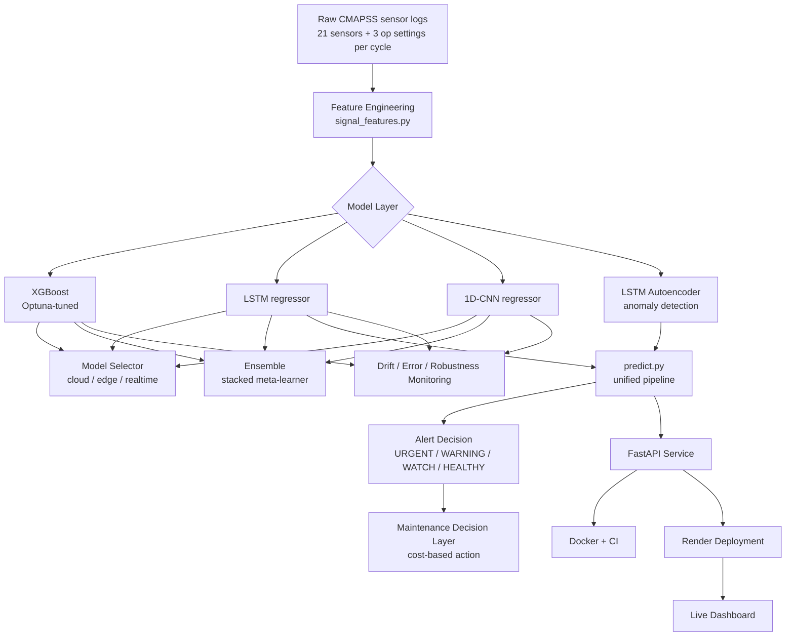

# Architecture

This document walks through the full pipeline end to end: what happens to
a raw sensor reading from ingestion through to a maintenance decision, and
why each stage is built the way it is. The README covers *what the results
are*; this covers *how the system is put together and why*.

## Overview

---

## Stage 1 — Raw Data

CMAPSS FD001: 100 training engines run to failure, 100 test engines
truncated before failure at an unknown point (see [Known Limitations in
the README](../README.md#known-limitations) for why this matters for
drift analysis). Each cycle records 21 sensors + 3 operating settings.

**Design choice:** near-constant sensors (std below a tiny threshold) are
dropped based on TRAIN statistics only, never test — `build_sequences.py`
computes this once and applies the same column set to both, so test data
never influences a preprocessing decision.

## Stage 2 — Feature Engineering (`signal_features.py`)

Raw sensor values alone under-use what's physically knowable about
degradation. Three families of engineered features are added:

- **Frequency-domain features** (FFT dominant energy) — grounded in
  classical rotating-machinery fault frequencies (bearing fault
  frequencies like BPFO/BPFI are a standard mechanical-engineering
  concept for detecting periodic wear signatures).
- **Rolling statistics** (mean/std over a 5-cycle window, rate-of-change)
  — captures short-term trend and volatility a single reading can't show.
- **Physics-informed cumulative features** (thermal stress index,
  cumulative fatigue integral) — ties directly to how real components
  degrade: damage accumulates, it doesn't reset each cycle.

**Why this matters for the "advanced" framing:** most ML-only approaches
treat sensor readings as an undifferentiated feature vector. Tying
features back to physical failure mechanisms is what makes SHAP
explanations (Stage 3) interpretable to a maintenance engineer, not just
a data scientist.

## Stage 3 — Model Layer

Three model families, deliberately kept architecturally distinct rather
than variations on one approach, so their failure modes are genuinely
different (a prerequisite for ensembling to have any chance of helping):

| Model | Why this architecture |
|---|---|
| **XGBoost** | Tree ensembles: no assumption about feature scale/distribution, natively interpretable via SHAP, fast single-row inference — good realtime/edge candidate. |
| **LSTM** | Sequence model: can learn temporal degradation patterns across the 30-cycle window rather than treating the last reading in isolation. Requires target normalization + gradient clipping to train stably (see code comments in `lstm_rul.py` for the exact fix and why it was needed). |
| **1D-CNN** | Alternative sequence model: convolutional receptive field over time instead of recurrence. BatchNorm makes it robust to target scale without the LSTM's normalization requirement. |
| **LSTM Autoencoder** | Unsupervised: flags sensor patterns unlike anything in *healthy* training data, including failure modes never explicitly labeled — a complementary signal to the supervised RUL models, not a replacement. |

**Critical fix applied during development:** the original train/val split
divided sliding windows randomly by index. Since consecutive windows
overlap by up to 29 timesteps, this let near-duplicate windows from the
*same engine* land in both train and validation — validation loss was
measuring memorization, not generalization, and early stopping triggered
on a leaky signal. Fixed by splitting whole **engines** (not windows)
between train/val. This is the kind of bug that produces a great-looking
validation curve and a much worse real test score — catching it is part
of why the numbers in this project are trustworthy.

## Stage 4 — Model Selection & Ensembling

`model_selector.py` treats "which model is best" as a function of
deployment constraint, not a single leaderboard: cloud picks the
highest-accuracy model, edge picks the smallest footprint, realtime picks
the lowest latency. All three genuinely disagree here (LSTM / CNN /
XGBoost respectively) — a real demonstration that model choice is a
deployment decision, not just a training-time one.

`ensemble.py` combines all three via simple averaging, RMSE-weighted
averaging, and out-of-fold Ridge stacking. The honest result: **no
ensemble beats the LSTM alone here.** The stacked meta-learner (fit with
a non-negativity constraint on its weights) independently assigned the
CNN a weight of 0.0 — it discovered the same conclusion a human would,
through optimization rather than a hand-tuned rule. That's reported
directly rather than forcing a "the ensemble won" narrative that wouldn't
be true.

## Stage 5 — Unified Prediction Pipeline (`predict.py`)

This is the piece that turns five separate experiments into one system.
A 30-cycle sensor window goes through:

1. **Anomaly check** (LSTM Autoencoder, native PyTorch) — unsupervised,
   catches sensor patterns unlike anything seen in healthy training data.
2. **RUL estimate** (LSTM, deployed via ONNX Runtime) — the
   best-performing model from Stage 3, running 2.79x faster via ONNX
   Runtime than native PyTorch with zero accuracy loss (verified to 3
   decimal places in `export_lstm_onnx.py`).
3. **Alert decision** — a simple, explicit, auditable rule combining both
   signals (not another model). This is a deliberate choice: the
   go/no-go maintenance call is a business/safety policy decision, and
   that should be transparent and inspectable, not a black box on top of
   a black box.

**Design note:** the autoencoder stays native PyTorch rather than ONNX,
because this project's edge-deployment rigor centers on the RUL model
(the one benchmarked/quantized/compared most thoroughly). Exporting the
autoencoder too is a reasonable next step, not part of this pipeline's
current scope — stated directly rather than implied otherwise.

## Stage 6 — Cost-Based Maintenance Decisions (`maintenance_decision.py`)

Translates predicted RUL into an actual recommendation (IMMEDIATE / SOON
/ MONITOR / OK) using threshold-based logic, then estimates dollar cost
of that action vs. a reactive run-to-failure baseline. This is the layer
that turns a number (RUL = 42) into a decision a maintenance team can
act on — the piece most ML-only projects skip, and the one that actually
gets used in industry. See the README's cost-figure caveat: the dollar
inputs are illustrative, the decision *logic* is the deliverable.

## Stage 7 — Monitoring: Drift, Error, Robustness

Three checks that ask "does this still work outside the conditions it
was validated under":

- **Drift** (`drift_monitor.py`): PSI + KS-test per feature, against the
  training distribution. Correctly distinguishes a real injected drift
  (PSI 5–10) from the CMAPSS train/test protocol artifact (PSI 0.2–0.5)
  — see the README for why that distinction matters.
- **Error analysis** (`error_analysis.py`): breaks error down by how
  close an engine truly is to failure, not just aggregate RMSE — surfaces
  that the model is most conservative exactly when it matters most (near
  true end-of-life) but overconfident mid-life.
- **Robustness** (`robustness_test.py`): noise and missing-data stress
  tests. Missing data hurts more than proportional noise at every
  severity level tested; switching from zero- to median-imputation
  roughly halves that penalty at realistic dropout rates — a concrete,
  measured mitigation, not just a documented weakness.

## Stage 8 — Serving & Deployment

- **FastAPI** (`api_server.py`) wraps `predict.py` with HTTP handling and
  input validation, without duplicating pipeline logic — improve the
  pipeline once, both the CLI script and the API benefit.
- **Docker** containerizes the service; only runtime-necessary files are
  copied in (serving code + model artifacts + prebuilt sequence arrays),
  not training scripts or raw data — keeps the image lean.
- **CI** (GitHub Actions) runs the pytest suite and a Docker build on
  every push.
- **Render** hosts the containerized API on its free tier. Verified: no
  out-of-memory issues despite the free tier's 512MB RAM ceiling, even
  with torch + onnxruntime + scikit-learn all loaded at once.
- **Dashboard** (`rul_monitor.html`) polls the live API, rendering the RUL
  gauge, anomaly flag, and cost estimate directly from the response —
  nothing client-side is faked except the cost arithmetic itself, which
  mirrors `maintenance_decision.py`'s logic in JavaScript.

---

## Why this design, as a whole, targets real industrial use

Each stage above maps to a question an industrial deployment actually
asks, not just a modeling exercise:

| Question | Answered by |
|---|---|
| "Can we trust this outside the lab?" | Drift monitoring, robustness testing |
| "Which model runs on which hardware?" | Model selector |
| "What do we tell the maintenance team to *do*?" | Maintenance decision layer |
| "Where does it fail, and is that dangerous?" | Error analysis by RUL bucket |
| "Can we actually run this, live, today?" | FastAPI + Docker + Render + dashboard |

That's the difference between "a model that predicts RUL" and a system
designed around how predictive maintenance actually gets adopted on a
factory floor.
